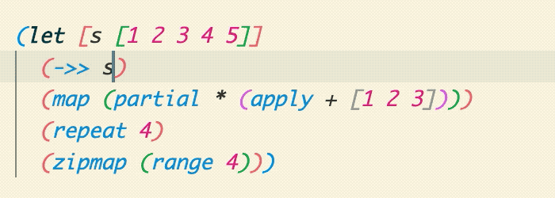
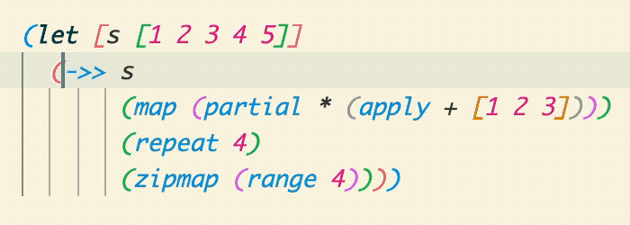

# JavaLand 2023: Functional Fun

## Ablauf

In diesem Repository befinden sich verschiedene Skripte, die Stück für Stück
aufgerufen und absolviert werden können. Viele Skripte dienen nur einem ersten
Eindruck. Hier ist eure Kreativität gefragt 🧑‍🎨 Wandelt die Aufgaben ab, denkt
weiter, experimentiert herum. Es geht hier nicht um das Lösen der Aufgaben,
sondern um das gemeinsame Lernen und Verstehen.

Fangen wir zuerst damit an den Editor einzurichten und starten dann mit den
Scripts im Ordner `src`.

## Voraussetzungen

- [Clojure Installieren](https://clojure.org/guides/install_clojure)
  - `brew install clojure/tools/clojure`
- Editor, wir werden mit VS Code arbeiten
  - [VSCode herunterladen](https://code.visualstudio.com/)
  - [Calva Plugin installieren](https://marketplace.visualstudio.com/items?itemName=betterthantomorrow.calva) Zur Installation oben auf den grünen Button ("Install") klicken.

Alternativ kann das Repository auch geforkt und in GitHub Codespace oder GitPod geöffnet werden.

https://user-images.githubusercontent.com/1507474/226466461-f2111031-0183-47c4-aded-4f8c6bbcf607.mp4

## Editor einrichten

Wir verwenden hier VS Code bzw. VS Codium mit dem Plugin [Calva](https://marketplace.visualstudio.com/items?itemName=betterthantomorrow.calva).
Dann starten wir eine REPL und verbinden den Editor damit. Das klappt besonders gut mit entsprechend konfiguriertem Editor, weshalb wir uns hier kurz die Zeit nehmen.

Hier ist ein kleines Video, um in VS Code eine Clojure REPL zu starten und den Editor damit zu verbinden. Dann können wir den Code direkt aus dem Editor in die REPL schicken.

### Tastenkürzel

Nachdem wir eine REPL erstellt und uns damit verbunden haben, können wir mit dem Editor interagieren.
Wichtig dabei ist vor allem die Tastenkombination `Ctrl+Enter`.
Mit dieser können wir **Code** direkt in die REPL **schicken**.

Außerdem wollen wir **Klammern verschieben** können.

Die folgenden Animationen stammen von https://calva.io/paredit/, wo auch die weiteren Befehle erklärt werden.

**Schließende Klammer nach rechts verschieben**

`Ctrl+Alt+Right` (Mac/Windows) oder `Cmd+Alt+.` (Linux)

**Schließende Klammer nach links verschieben**

`Ctrl+Alt+Left` (Mac/Windows) oder `Cmd+Alt+,` (Linux)

## Team

- [@n2o](https://github.com/n2o), Christian Meter, Twitter: [cmeter\_](https://twitter.com/cmeter_)
- [@bendisposto](https://github.com/bendisposto), Jens Bendisposto, Twitter: [jbendisposto](https://twitter.com/jbendisposto)
- [@ebbinghaus](https://github.com/MrEbbinghaus), Björn Ebbinghaus, Twitter: [MrEbbinghaus](https://twitter.com/MrEbbinghaus)
- [@Wegi](https://github.com/Wegi), Alexander Schneider, Twitter: [MrEbbinghaus](https://twitter.com/TheWegi)
